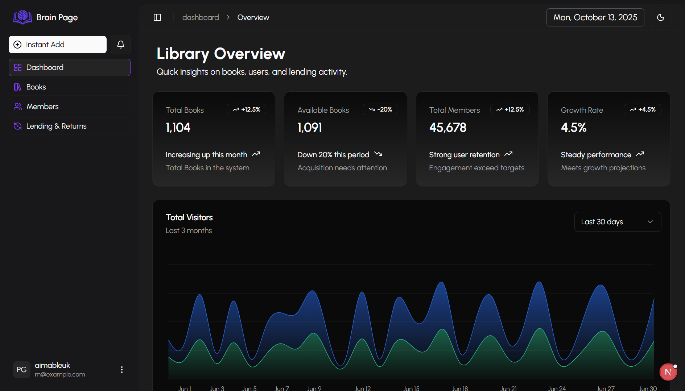

# 📚 BRAIN PAGE – Library Management System

**BRAIN PAGE** is a modern **Library Management System** designed to simplify how libraries organize, track, and manage books, members, and borrowing activities.  
It features a **Next.js** frontend for a sleek and responsive user interface and a **Django REST Framework** backend for secure and efficient data handling.

---

<p>
  
</p>


## 🚀 Tech Stack

| Layer                 | Technology                                                     |
| --------------------- | -------------------------------------------------------------- |
| **Frontend**          | [Next.js](https://nextjs.org/) (React Framework), Tailwind CSS |
| **Backend**           | [Django](https://www.djangoproject.com/)                       |
| **Database**          | SQLite (development) / PostgreSQL (production)                 |
| **API Communication** | REST API (JSON-based)                                          |
| **Version Control**   | Git + GitHub                                                   |

---

## 🧩 Features

### 📘 Book Management

- Add, edit, delete, and list books
- Track ISBN, author, genre, publication year, and availability

### 👩‍🏫 Member Management

- Register and update library members
- Manage borrowing history per member

### 🔄 Borrowing System

- Lend and return books
- Track due dates and overdue fines

### 📊 Dashboard & Analytics

- Overview of total books, borrowed items, and active members
- Filter and search books or members easily

### 🔐 Authentication

- User login and registration
- Admin privileges for managing library data

---

## ⚙️ Installation & Setup

### 🖥️ Frontend (Next.js)

```bash
# Navigate to frontend(brain_page) folder
cd frontend

# Install dependencies
npm install

# Run the development server
npm run dev
```

Frontend will run on **http://localhost:3000**

### ⚙️ Backend (Django)

```bash
# Navigate to backend(brain_page_backend) folder
cd backend

# Create virtual environment
python -m venv venv
source venv/bin/activate   # On Windows: venv\Scripts\activate

# Install dependencies
pip install -r requirements.txt

# Run migrations
python manage.py migrate

# Start the server
python manage.py runserver
```

Backend will run on **http://127.0.0.1:8000**

---

## 🔗 Connecting Frontend & Backend

Make sure your API base URL in the frontend matches the Django backend URL.  
Example:

```js
// frontend/utils/api.js
export const NEXT_PUBLIC_BASE_URL = "http://127.0.0.1:8000/api/v1";
```

---

## 🧠 Developer Notes

- The frontend uses **Axios** for data fetching.
- Backend uses **Django REST Framework serializers** and **views** for CRUD operations.
- You can easily deploy the project using:
  - **Vercel** for Next.js frontend
  - **Render** or **Railway** for Django backend

---

## 🧪 Testing

### Frontend

```bash
npm run test
```

### Backend

```bash
python manage.py test
```

---

## 📁 Environment Variables

### Frontend

| Variable              | Description                |
| --------------------- | -------------------------- |
| `NEXT_PUBLIC_API_URL` | Base URL of the Django API |

### Backend

| Variable        | Description                         |
| --------------- | ----------------------------------- |
| `SECRET_KEY`    | Django secret key                   |
| `DEBUG`         | Development mode toggle             |
| `DATABASE_URL`  | PostgreSQL/SQLite connection string |
| `ALLOWED_HOSTS` | Allowed domains for deployment      |

---

## 💡 Future Enhancements

- Add role-based access control (Admin, Librarian, Member)
- Implement notifications for overdue books
- Add book cover uploads using Django Storage
- Enable dark mode UI in frontend

---

## 👨‍💻 Author

**BRAIN PAGE** was developed by [UKOBIZABA Aimable](https://ukobizaba-aimable.vercel.app/)
Passionate about building smart, user-focused web applications.

---

## 📜 License

This project is open-source and available under the **MIT License**.
